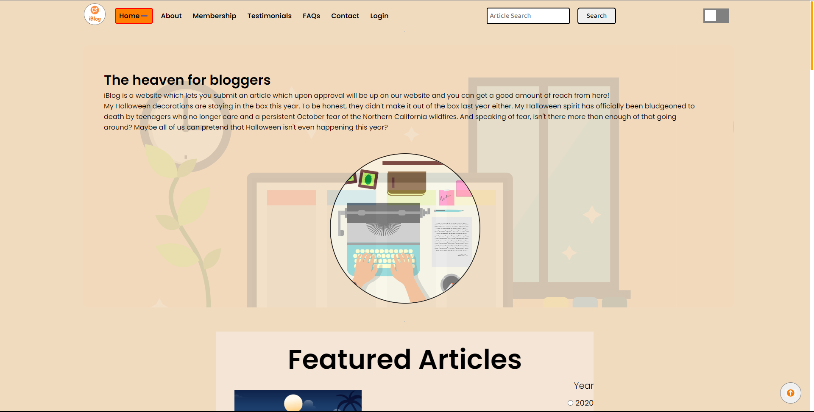

# 📜 iBlog

iBlog - A dynamic blogging platform for valuable information, easy navigation and modern design. Our website include various sections of Home, About, Membership, Testimonials , Contact and Search bar.

## <h1 align=center>Screenshot 📸</h1>

## 📌 Key Features

- Responsive design: The website should be optimized for viewing on various digital gadgets including desktop computers, laptops, tablets, and smartphones.

- Social media integration: Blog owners should be able to easily share their posts on popular social media platforms such as Facebook, Twitter, LinkedIn  , Instagram and so on.

- User-friendly comment system: A blog should have a commenting system that is easy to use, both for the blogger and for the visitors to read the blog.

- Analytics and statistics: Blog owners should be able to view analytics and statistics related to their blog such as page views, unique visitors, post impressions and popular posts.

- Categories and tags: Blogs should have a system for organizing posts into their respective categories and tags based on the topic and relevant information which will help visitors to find their suitable content more easily.

- Related posts: A related post feature can show visitors other articles on the blog that are related to the post which they are currently reading in order to encourage them to explore the blog further.

- Email subscription: Visitors should be able to subscribe to the blog via email, to receive notifications of new posts.

- Contact form: A contact form should be provided to allow visitors to easily get in touch with the blog owner.

- Related blog suggestion: A feature that suggests other relevant blogs to the reader based on the topics they are interested in, helping them discover new content and expand their reading skills.

- Dark Mode: Added Dark mode so that user gets comfortable with the website.

## Repo Status

  

  

  
 - Drop a :star: on the Github repository (optional) 

- Before doing a Contribution Please read [CONTRIBUTING.md](https://github.com/mrbhatt2348/iBlog/blob/main/contributing.md) and [CODE_OF_CONDUCT.md](https://github.com/mrbhatt2348/iBlog/blob/main/CODE_OF_CONDUCT.md)

 

##  <h1 align=center>CONTRIBUTIONS 👏</h1>

## 🧑‍💻 About the Admin

| Admin  | 
| :----------: | 
| Rajkumar Bhatt |
 

## 👩🏽‍💻 Contributions

- Contributions make the open source community such an amazing place to learn, inspire, and create.
- Any contributions you make are greatly appreciated.

## Thanks to our Contributors

 

<h1 align="center">
 <b>Thanks to these amazing people!!</b>
<h1>

   

<h1 align=center> Project's Admin  🤵 </h1>

  

  
  

  &nbsp;&nbsp;&nbsp;&nbsp;
  &nbsp;&nbsp;&nbsp;&nbsp;

  
 

  
  
